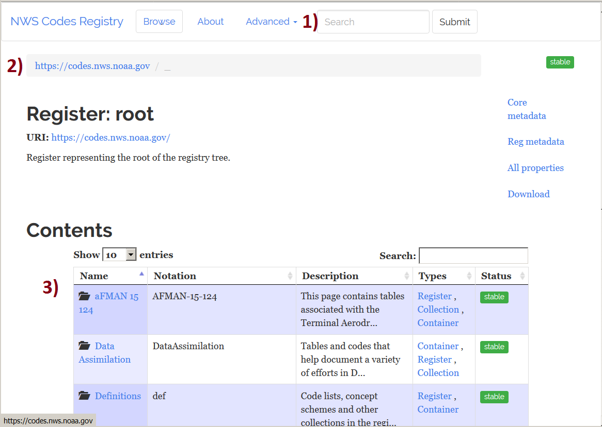
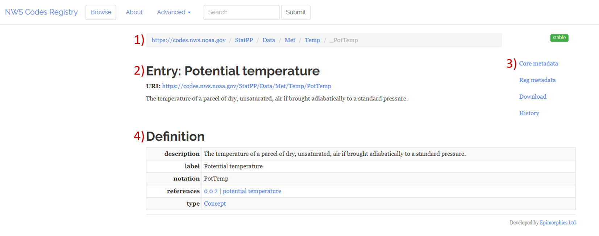

===========================================================
The NWS Codes Registry:  Using linked data to support CAMPS
===========================================================

**************************************
Introduction to the NWS Codes Registry
**************************************

The NWS Codes Registry (https://codes.nws.noaa.gov) supports a number of projects, including XML-encoding of 
aviation products and the Community Atmospheric Model Post-processing System (CAMPS).  Most of the techniques 
described here apply to all of them.  The technical documentation for the codes registry API 
can be found at https://github.com/UKGovLD/registry-core/wiki/Api.

Code Registry Basics
====================

Upon navigating to the NWS Codes Registry website, users are directed to the Registry’s main page (Fig. 1). 
From there, one may search directly for a specific entry or group of entries by typing text into the search box 
at the top of the page (red numeral “1”, Fig. 1), or may browse through the registry by using the URI navigation bar (2) 
and the links for the various “collections” of entries found in the table of contents at the middle of the page (3). 
The Registry may be traversed as a nested file system by using the links of the desired collections to move to the desired collection and level of the registry tree.

Conversely, the navigation bar can be used to navigate quickly back *up* the Registry “tree”. 
The various path segments of the URI are separate, clickable links, which will take the user to the Registry contents page at that level. 
(*Note:* In addition to clicking on the link for the “root” level in the navigation bar, the “Browse” 
button at the top of the page may also be used to return quickly to the main page of the Registry.)

Figure 1:  Main or "Home" page of Registry at root level

Once at the desired level of the Registry, the user can obtain metadata for specific “concept” 
entries by clicking on their links in the table of contents. Most of the entries that will be of 
interest to StatPP practitioners are found under the collection named “Statistical Post Processing”.

Figure 2 is a screenshot of the GUI display after navigating to the entry for “Potential temperature” 
**URI:** https://codes.nws.noaa.gov/StatPP/Data/Met/Temp/PotTemp in the “/statPP/Data/Met/Temp” collection of the Registry.
Note:  1) the navigation bar with links to all levels above the current Registry level, 
2) the entry name and link to the full URI near the center of the page, and 
3) a further set of links near the upper right of the page which can be used to view or download metadata and history information for this entry.
The “core” metadata for the entry is displayed at the bottom portion of the page under the heading “Definition” 
(4). The core metadata includes a number of standard properties (“description”, “label”, “notation”, “references”, “type”, etc.) which are used to describe the entry
 

Figure 2: Registry GUI display for "Potential Temperature" under /StatPP/Data/Met/Temp

.. note:: 
    In this case, the “description” is quite generic, however this field will often contain more extensive and detailed language. Further, the “references” and “type” fields may contain links to other URIs which more completely describe the particular concept or collection. In this case our "type" is a Concept and we have two "references", one points to the WMO Codes Registry entry for Potential Temperature (0 0 2) and the other the AMS Glossary definition of Potential Temperature.

***************************************************
How to submit new entries to the NWS Codes Registry
***************************************************

Entries for statistical post-processing
=======================================

Entries for statistical post-processing were drawn originally from concepts, variables, and procedures used in the MOS-2000 statistical post-processing system, 
augmented with various WMO resources. Requests for new entries should be submited as a .csv (or similar spreadsheet format) file with 
specific formatting the user should follow which is outlined in Figures 3a, 3b, and 3c. 
 
Submissions of new items and their metadata should be in exactly the same format as the example entries. 
New entries will be added to the Registry only after their metadata 
are determined to be in good order and the entries have been approved by the CAMPS Metadata Review Team via an internal review process. 

.. note:: 
    See the “Definitions and References” (Fig. 3c) for further explanation of the metadata properties required for entry into the Registry and their format.  

Developers proposing new entries for the Registry should submit their requests via the CAMPS github page (more to come on that soon!)
A member of the CAMPS team will initiate the internal review process. 
The CAMPS team will work to ensure that the requested entries are necessary (i.e. that functionally similar entries do not already exist 
elsewhere in the Registry which could be used to describe the proposed Concept), and conform to CAMPS metadata standards for software and netCDF datasets.

Once the CAMPS Metadata Review Team is satisfied that the metadata request is well-posed, properly organized for the Registry, 
and conforms to CAMPS standards, the new entry will be added to the registry.

.. figure:: collections_request.png
   :alt: Figure 3a: Metadata Request Form for Codes Regsitry Collections

Figure 3a: Metadata Request Form for Codes Regsitry Collections

.. figure:: Concepts_request.png
   :alt: Figure 3b: Metadata Request Form for Codes Registry Concepts

Figure 3b: Metadata Request Form for Codes Registry Concepts

.. figure:: Definitions_referernces_requests.png
   :alt: Figure 3c: Definitions and References 

Figure 3c: Definitions and References

Entries for other projects
==========================

Code Registry entries for projects other than StatPP should follow the procedures established elsewhere by the Administrators of those particular projects. 
These will generally not be reviewed by the CAMPS team for adherence to CAMPS StatPP metadata standards, but occasionally may need to be added to the 
Registry by a CAMPS Administrator or superuser.

