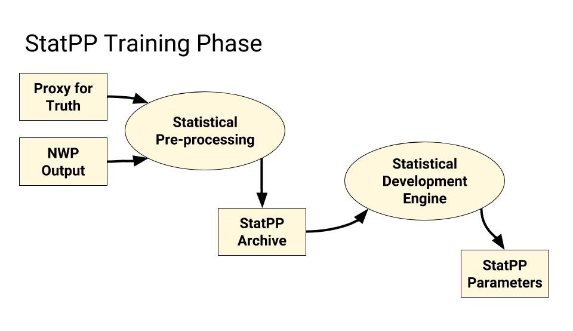
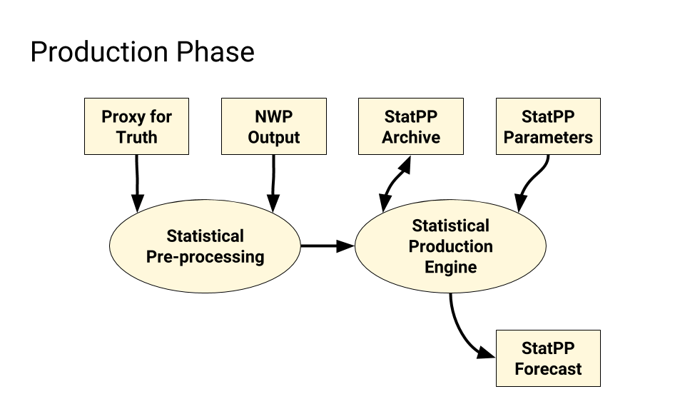

.. _background:

======================================
Statistical Post-Processing Background
======================================

**Statistical post-processing (StatPP)** refers to the adjustment of current real-time
forecast guidance using the discrepancies noted between past forecasts and
observations/analyses. Past experience has shown that StatPP is capable of
modifying real-time NWP guidance that is biased, somewhat unskillful, and
unreliable into guidance that is unbiased, much more skillful, downscaled to
local conditions, and highly reliable, thus making it suitable for use in
decision support with little or no manual modification by forecasters.”
StatPP can also ameliorate deficiencies due to finite ensemble size and infer
forecasts for weather elements that are not directly forecast by the NWP system.
(Cf. Hamill and Peroutka, 2016: High-Level Functional Requirements for
Statistical Post-Processing in NOAA.)

It is a truism among StatPP developers that they spend 10% of their time in
science, 10% in statistics, and 80% in bookkeeping. Indeed, metadata storage and
use are key aspects to any successful StatPP project. Daunting amounts of data
characterize the training phase of many techniques. Some techniques defer these
challenges to the production phase.

For many StatPP techniques, the **Training Phase** or **Development Phase** is a set of
processes and software that notes discrepancies between past forecasts and
observations/analyses and distills them into a set of parameters. The Model
Output Statistics (MOS) and Kalman Filter techniques both have distinct training
phases. Most bias-correction techniques, however, do not.

All StatPP techniques have a **Production Phase** or **Implementation Phase**, which
is the set of processes and software that creates output forecasts.

The **Proxy for Truth** is the set of observations/analyses that guides the StatPP
process. The name recognizes the biases and errors that afflict our best
observing platforms and analytical techniques. The proxy for truth is generally
accepted to be adequate for the task of StatPP.

**Numerical Weather Prediction (NWP)** generally begins with some form of
**Data Assimilation (DA)** which is followed by one or more runs of a NWP system.
Additional steps may be required to breed perturbed inputs to facilitate an
ensemble of NWP runs. The final step of an NWP run is named the Model Post;
this step generally converts output from the specialized coordinate reference
systems used in NWP (e.g., spherical harmonics and sigma levels) to more
standard coordinate reference systems. StatPP applications generally work with
these standard outputs.

Many StatPP applications use some form of **Statistical Pre-processing** step where
**NWP output** from multiple runs is captured in a **StatPP Archive**. This Statistical
Pre-processing captures the data needed for the Training Phase. Often, NWP
output is transformed in ways that facilitate statistical training. In general,
if a Statistical Pre-processing step is required in the Training Phase, that
same step will also appear in the Production Step.

A Training Phase, if present, will use one or more **Statistical Development
Engines** to note discrepancies between past NWP output and a selected Proxy for
Truth. These discrepancies are then captured in a set of **StatPP Parameters** which
can be used in the Production Phase.

Figure 1, below, attempts to capture some of these concepts in a data flow diagram.

Figure 2, below, also captures these concepts, but applies them to the **Production Phase**.

